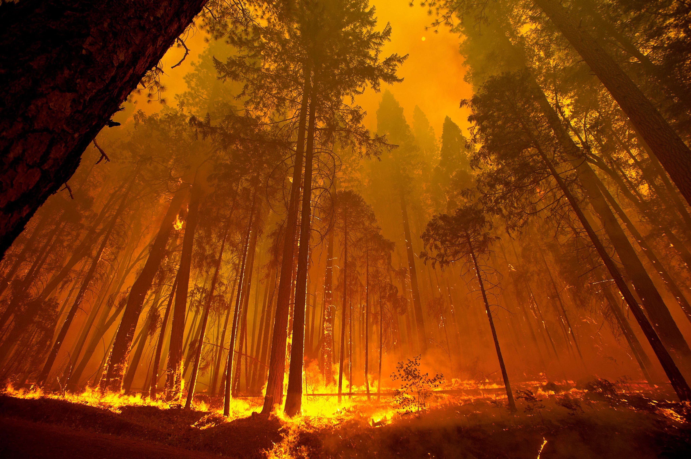

# Fire-AI Project README

## Table of Contents

- [Introduction](#introduction)
- [Features](#features)
- [Usage](#usage)
- [Dataset](#dataset)
- [Training](#training)

## Introduction

Fire-AI is an open-source project built with PyTorch for NASA Space App Challange in Stalowa Wola 2023 (team "Galaktyczne Bambiki") that aims to recognize and detect fires in wooded areas using deep learning techniques. This project provides a comprehensive solution for early fire detection in forests, which can be critical for preventing wildfires and protecting the environment.



## Features

- Fire detection in (images) wooded areas.
- Efficient and accurate detection using PyTorch.
- Customizable architecture for different scenarios.

## Requirements

- Python 3.8+
- PyTorch 1.2+
- torchvision
- NumPy
- OpenCV
- Matplotlib

You can install these dependencies using `pip`

## Installation

1. Clone the Fire-AI repository:

   ```bash
   https://github.com/Galaktyczne-Bambiki/fire-ai
   ```

2. Navigate to the project directory:

   ```bash
   cd fire-ai
   ```

## Usage

### Dataset

https://www.kaggle.com/datasets/phylake1337/fire-dataset

To train and test the fire detection model, you will need a dataset of images containing both fire and non-fire images. Organize your dataset into two separate folders: `fire` and `non-fire`, and place them inside a directory called `fire_dataset`. Ensure that the dataset structure looks like this:

```
fire_dataset/
  train/
    fire/
      fire.1.jpg
      fire.2.jpg
      ...
    non-fire/
      non_fire.1.jpg
      non_fire.2.jpg
      ...
```

### Training, Extract model, Load model

Train the fire detection model in jupyter notebook (fireRecognition.ipynb) section

The model can by exported in onnx format
